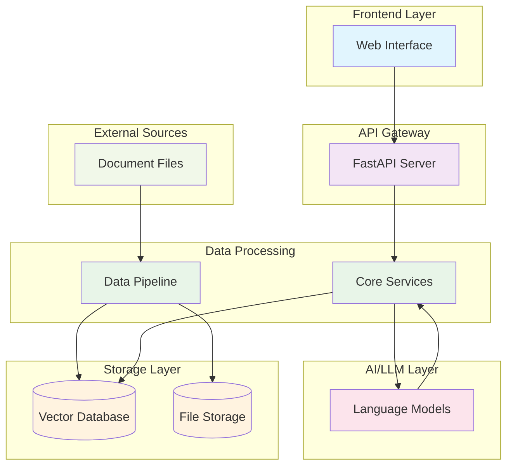
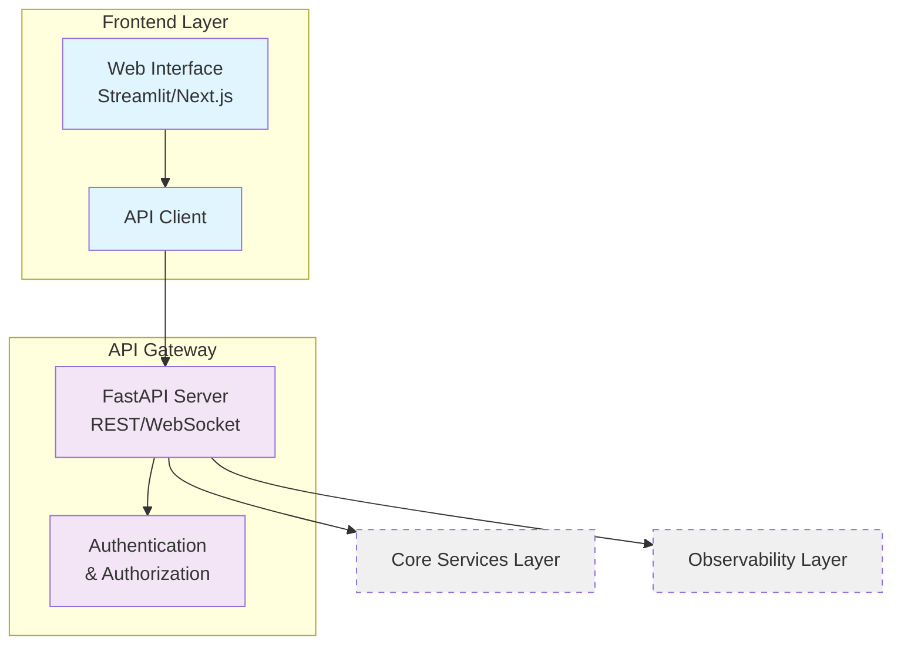
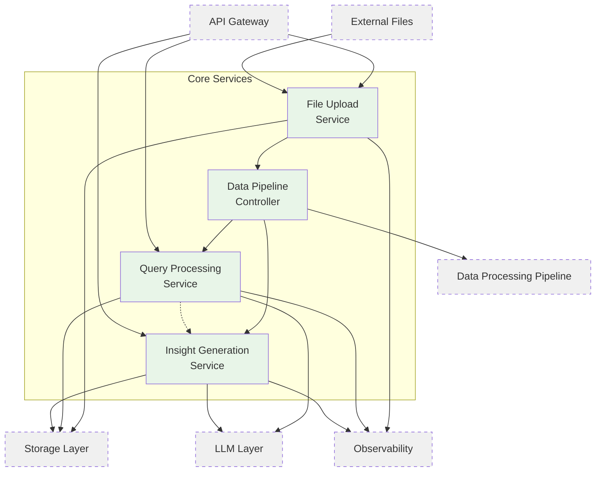
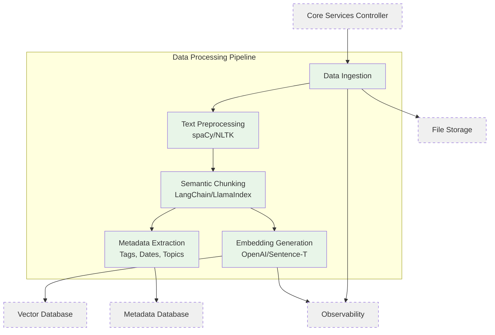
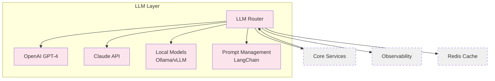
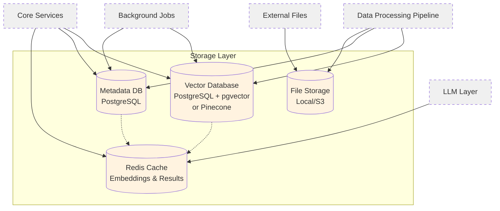
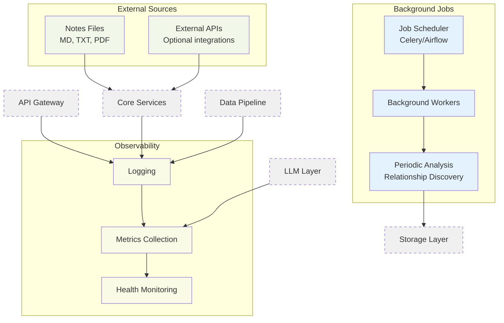
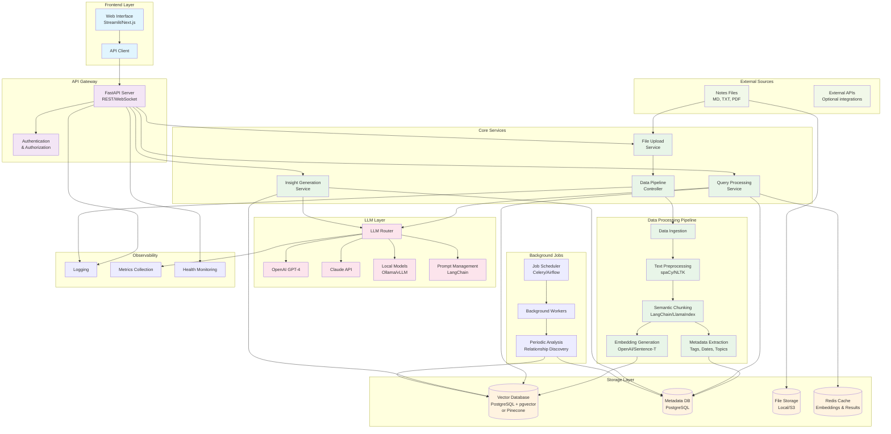
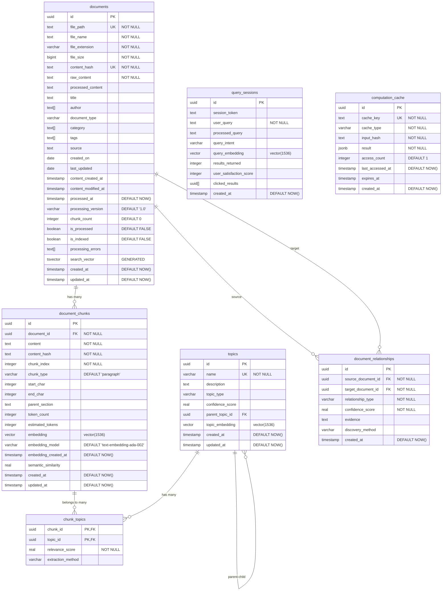

# Definition of Done

- I have embedded all of my and have them in a Vector DB.
- My (new) notes are processed on a weekly basis.
- I can query my notes and get both:
  - A synthesised answer.
  - References to the original documents.
- The above is rendered in some basic form of a web UI.

# Context

I write many notes on every sort of topic that I learn or media that I consume, and I want to develop and app that will use LLM models as well as a basic data pipeline to ask questions about my own thinking (as captured in those notes) throughout the years I haven been taking notes.

As interested as I am in questioning my own notes and thinking, my objective is also to learn and get exposure into data (RAG-ish) pipelines, as well as general app development. I am a web developer with ~3 years of experience in both front end and back end technologies, but primarily the latter.

The notes are in markdown format and are all found under a specific directory in my local Desktop, although they can be nested within further directories.
Most of these have also some additional metadata at the beginning of the content, which can look like, for instance, the two examples below. There is some variation in their properties and they might not capture all of the document's data, but they can be helpful.

```markdown
---
last updated: 2025-05-25
created_on: 2025-05-24
---
```

```markdown
---
author:
  - Greg McKeown
type:
  - reference
category:
  - book
created_on: 2025-05-08
last updated: 2025-05-14
source:
checked: false
---
```

# Architecture

## High-level System Design



## Individual Component Structure

**FrontEnd and API**



**Core Services Layer**



**Data Processing Pipeline**



**LLM Layer**



**Storage Layer**



**Background Jobs and Observability**



## Comprehensive Low-level System Architecture

The below is better seem in the online Mermaid chart live editor.



# Data Schema

## Fully-fleshed



## MVP-scoped

# Tech Stack

The below structure roughly corresponds to the architectural requirements.

```text
personal-knowledge-ai/
├── README.md
├── .gitignore
├── docker-compose.yml
├── .env.example
├── Makefile
├── package.json           # Root JS dependencies
├── pyproject.toml         # Root Python config
├── requirements-dev.txt   # Python dev deps

├── apps/
│   ├── api/               # FastAPI backend
│   │   ├── main.py
│   │   ├── routes/
│   │   ├── middleware/
│   │   ├── dependencies/
│   │   ├── models/
│   │   └── tests/
│   │
│   ├── web/               # React app with custom SSR
│   │   ├── package.json
│   │   ├── vite.config.ts
│   │
│   │   ├── src/
│   │   │   ├── entry-client.tsx
│   │   │   ├── entry-server.tsx
│   │   │   ├── App.tsx
│   │   │   ├── components/
│   │   │   ├── pages/             # Route-based pages
│   │   │   ├── hooks/
│   │   │   └── lib/
│   │   └── tests/
│
│   └── worker/            # Background job processor
│       ├── main.py
│       ├── tasks/
│       └── tests/

├── libs/                  # Shared libraries
│   ├── core/              # Core business logic
│   ├── pipeline/          # Data processing pipeline
│   ├── llm/               # LLM abstraction layer
│   ├── storage/           # File/vector/meta stores
│   └── shared/            # Utilities, config, logging

├── scripts/               # Utility/setup scripts
├── docs/                  # Project documentation
└── tests/                 # High-level integration & E2E

```

- Considerations
  - A Monorepo is used in order to facilitate the iteration for a single developer, including the ability to update types during development over the OpenAPI standards
  - Turborepo will be used for build parallelisation if necessary once deploying the application in its entirety.
- Tooling Choices
  - Client-side
    - SSR React + Tanstack Router / Query
    - Zod for Validation
    - Vitest for testing
    - Vite as a build tool
    - CSS Styles for styng
  - Server Layer
    - FastApi (Python) as Web framewrok
    - Pydantic
    - Testing?
  - Data Pipeline
    - Langchain
    - Open Ai Embeddings and Open Ai models for chat initially, to be made swappable in case a different combination is decided.
  - Logging
    - structlog
    - Sentry
  - Storage
    - SQLAlchemy 2.0 - ORM for PostgreSQL
    - Alembic for Database migrations
    - asyncpg - Async PostgreSQL driver
    - pgvector - Vector extension
